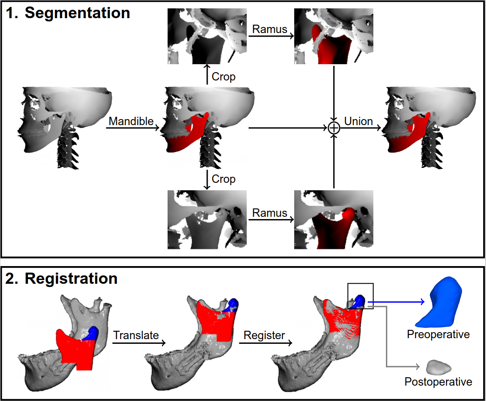

# Fully Automatic Assessment of Mandibular Condyle Changes

Welcome to the repository accompanying the article "Validation of a Fully Automatic Assessment of Volume Changes in Mandibular Condyles"

## Method



Please see the article for a more in-depth description of the developed method.

### 1. Segmentation

The fully-automatic method starts with a segmentation of the mandible, including the condyles, using a coarse-to-fine strategy. The first step predicts a segmentation of the mandible and crops of the CBCT scan are taken around each condyle, whereafter the second step predicts a more precise segmentatiof the condyles.

### 2. Registration

The voxel-wise segmentation of the complete mandible in a CBCT scan was reconstructed to a surface mesh to register a preoperative ramal segment to a postoperative ramal segment. Finally, a volume of interest around the preoperative condyle was determined, based on which the pre- and postoperative condyles were determined to measure their volume change.


## Install with conda

```
conda install pytorch torchvision torchaudio cudatoolkit=11.3 -c pytorch
pip install torch-scatter -f https://data.pyg.org/whl/torch-1.11.0+cu113.html
pip install -r jawfrac/requirements.txt
```

## Replicate

Please request model checkpoints from Niels van Nistelrooij (Niels dot vanNistelrooij at radboudumc dot nl).

## Citation

``` bibtex
@article{condyle_changes,
  author={Holte, Michael Boelstoft and van Nistelrooij, Niels and Vinayahalingam, Shankeeth and Berg{\'e}, Stefaan and Xi, Tong and Pinholt, Else Marie},
  year={2025},
  month={03},
  title={Validation of a fully automatic assessment of volume changes in the mandibular condyles following bimaxillary surgery},
  journal={International Journal of Oral and Maxillofacial Surgery},
  doi={10.1016/j.ijom.2025.02.009}
}
```
